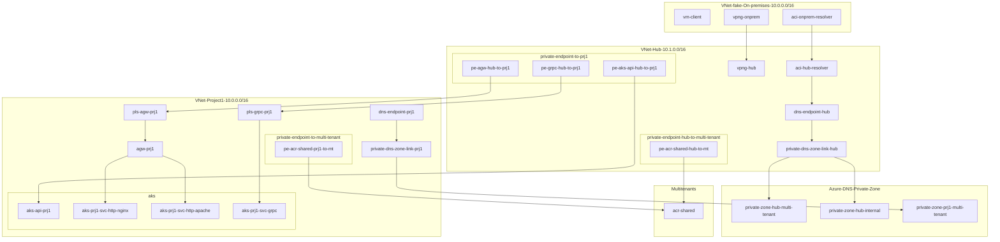

# Sample "anti-peering" Hub-spoke network pattern for private AKS with Private Link Service

## Problem statement

* Want to assign many IP addresses to new container applications created on Azure Kubernetes Service(AKS)
* There are many [prerequisites and considerations](https://docs.microsoft.com/en-us/azure/aks/configure-azure-cni) in the network design of Kubernetes and AKS
* On the other hand, need to connect to On-premises or other VNets in Azure
* With conventional methods such as peering, the number of IP addresses is insufficient or overlapped
* Even though there are not many IP addresses that we want to expose to On-premises and other VNets

## Candidate solution

* [NAT on VPN Gateway](https://docs.microsoft.com/en-us/azure/vpn-gateway/nat-overview)
  * Limitation: NAT for VNet-to-VNet connection is [not supported](https://docs.microsoft.com/en-us/azure/vpn-gateway/nat-overview#nat-limitations)
* [Private endpoint for AKS API(Control Plane)](https://docs.microsoft.com/en-us/azure/aks/private-clusters#use-a-private-endpoint-connection)
* [Private Link Service](https://docs.microsoft.com/en-us/azure/private-link/private-link-service-overview) for AKS Service(Data Plane)
  * Limitation: [Need to manually create and maintain PLS and port mapping](https://dev.to/lastcoolnameleft/azure-private-link-service-load-balancer-aks-limitation-44db)

## Solution

* Connect VNets (expose endpoints) with Private Link Service and Private Endpoint
  * for AKS API Server with Private Endpoint
  * for HTTP(s) with [Application Gateway Private Link Service](https://docs.microsoft.com/en-us/azure/application-gateway/private-link) (New! Preview as of June 2022)
    * You can consolidate endpoints with [Application Gateway multiple site hosting](https://docs.microsoft.com/en-us/azure/application-gateway/multiple-site-overview)
  * for non-HTTP(s) or protocols that Application Gateway does not currently support such as gRPC, with [AKS Managed Private Link Service integration](https://docs.microsoft.com/en-us/azure/aks/internal-lb#connect-azure-private-link-service-to-internal-load-balancer-preview) (New! Preview as of June 2022)
    * [Details](https://github.com/kubernetes-sigs/cloud-provider-azure/blob/master/site/content/en/topics/pls-integration.md)
* Expose multi-tenant managed services such as Azure Container Registry with [Private Endpoint](https://docs.microsoft.com/en-us/azure/private-link/private-endpoint-overview)

VNet for projects are able to have the same address space as others and On-premises! You got freedom.

## Overview of sample

### Key components

* (Fake)On-premises VNet
  * Client VM
  * DNS Resolver container (zone forwarder for Hub VNet linked DNS)
  * VPN Gateway to Hub VNet (ER is also OK)
* Hub VNet
  * VPN Gateway to On-premises VNet
  * DNS Resolver container (Alternative: [Azure DNS Private Resolver](https://docs.microsoft.com/en-us/azure/dns/dns-private-resolver-overview))
  * Linked private DNS zone
    * for service on Project VNet: project1.internal.poc
    * for multi tenant managed service: privatelink.azurecr.io, (zone).privatelink.(region).azmk8s.io
  * Private Endpoint to Project VNet
    * for AKS API Server
    * for AKS Services: HTTP and gRPC
* Project VNet
  * Private AKS Cluster
  * Private Link Service to HTTP service (NGINX and Apache) on AKS with Application Gateway
  * Private Link Service to gRPC service (simple greeter) on AKS with AKS Managed Private Link Service
  * Private Endpoint to multi tenant managed service (Azure Container Registry)
  * Linked private DNS zone
    * for multi tenant managed service: privatelink.azurecr.io
* Multi tenant managed service
  * Azure Container Registry

### Diagram



## Use cases

### Operate AKS Cluster from On-premises client via Private Endpoint

```shell
myname@mytenant@vm-client:~$ az aks get-credentials -g rg-hs-aks-pls-project-1 -n myprefix-aks-prj1
Merged "myprefix-aks-prj1" as current context in /home/me/.kube/config

myname@mytenant@vm-client:~$ kubectl config get-contexts
CURRENT   NAME                CLUSTER             AUTHINFO                                                    NAMESPACE
*         myprefix-aks-prj1   myprefix-aks-prj1   clusterUser_rg-hs-aks-pls-project-1_myprefix-aks-prj1

myname@mytenant@vm-client:~$ kubectl get po
NAME                            READY   STATUS    RESTARTS   AGE
apache-9d985fd96-qsmm9          1/1     Running   0          66m
grpc-greeter-748c88c99c-q4qmc   1/1     Running   0          66m
nginx-7b9f488bb4-dwlgj          1/1     Running   0          66m
```

### Access HTTP service via consolidated HTTP Private Endpoint

```shell
myname@mytenant@vm-client:~$ dig nginx.project1.internal.poc
[snip]
;; ANSWER SECTION:
nginx.project1.internal.poc. 290 IN     A       10.1.0.8
[snip]

myname@mytenant@vm-client:~$ dig apache.project1.internal.poc
[snip]
;; ANSWER SECTION:
apache.project1.internal.poc. 300 IN    A       10.1.0.8
[snip]

myname@mytenant@vm-client:~$ curl nginx.project1.internal.poc
[snip]
<h1>Welcome to nginx!</h1>
[snip]

myname@mytenant@vm-client:~$ curl apache.project1.internal.poc
<html><body><h1>It works!</h1></body></html>
```

### Access gRPC service via Private Endpoint

```shell
myname@mytenant@vm-client:~$ grpcurl -plaintext grpc-greeter.project1.internal.poc:50051 list
grpc.reflection.v1alpha.ServerReflection
helloworld.Greeter

myname@mytenant@vm-client:~$ grpcurl -plaintext -d '{"name": "Toru"}' grpc-greeter.project1.internal.poc:50051 helloworld.Greeter/SayHello
{
  "message": "Hello Toru, this is grpc-greeter-748c88c99c-q4qmc"
}
```

## Considerations

* Scalability of Private Link Service
  * Private Link has [limits](https://docs.microsoft.com/en-us/azure/private-link/private-link-faq#how-can-i-scale-my-private-link-service--) on the number that can be configured, e.g. 8 IPs per Private Link Service.
* Outbound traffic control on Project VNet
  * Simple: One Azure Firewall per Project VNet
  * Shared: Share one Azure Firewall with multiple projects
    * Need peering, so lose the freedom of network design (trade-off!)
* Resouce grouping, ownership and permissions
  * There are resources such as endpoints that are difficult to decide whether to put in a shared group or a project.
  * Consider the onwership and delegation of work when the project increases and during operation
